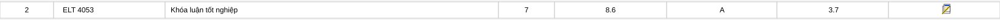
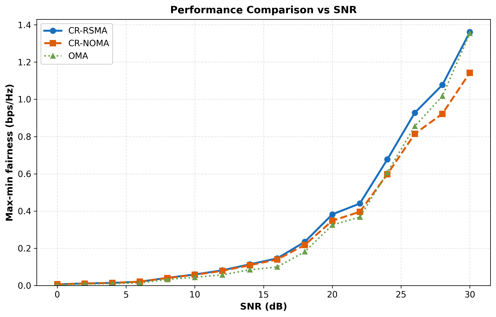
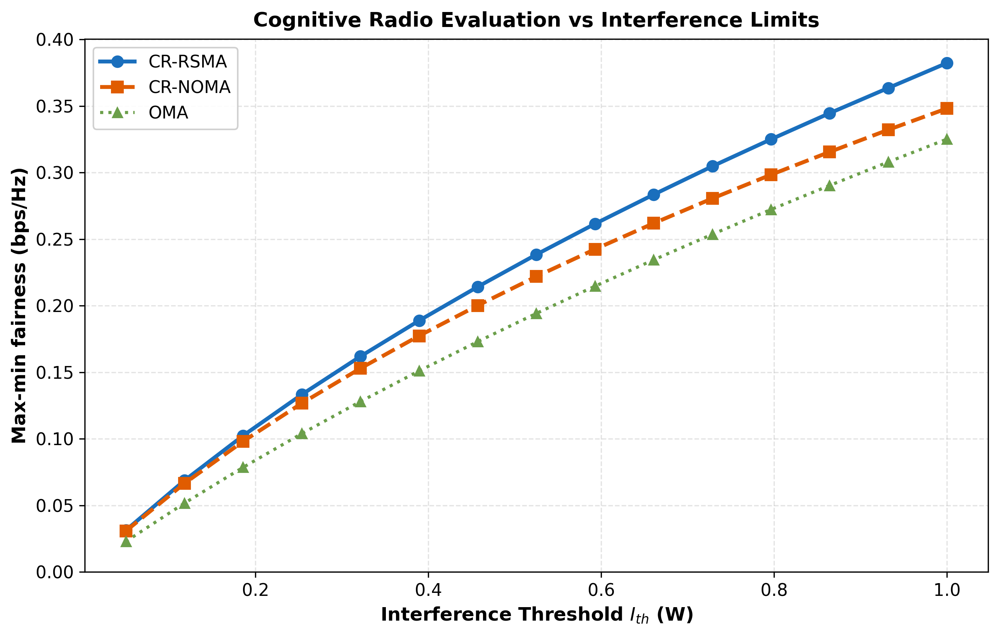
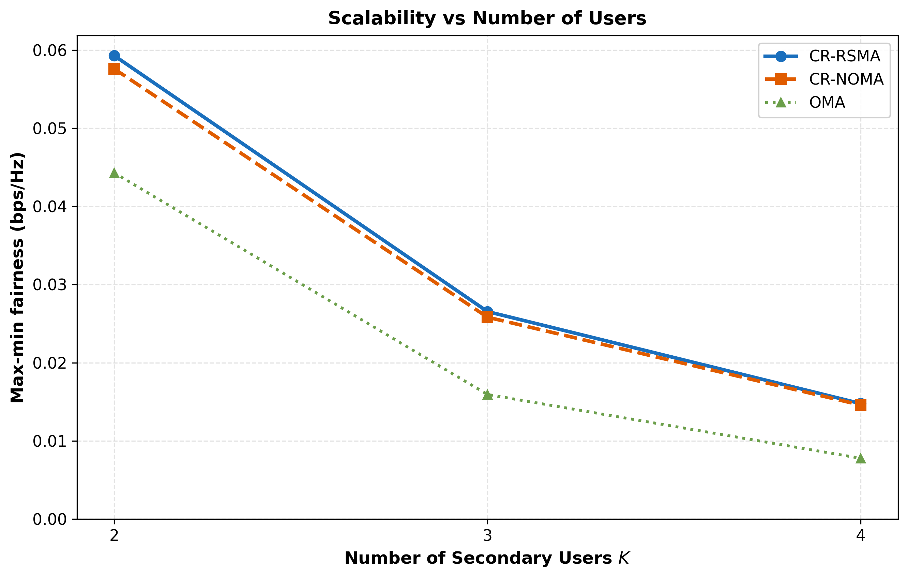

# Fairness Simulation

Project mô phỏng và so sánh hiệu năng **CR-RSMA**, **CR-NOMA** và **OMA** trong hệ thống Underlay Cognitive Radio SISO MAC. Mục tiêu chính là tối ưu **max-min fairness (MMF)** cho các Secondary Users, sau đó ánh xạ tốc độ đạt được sang chất lượng video SVC theo PSNR.

## Kết quả học phần



## Nội dung mô phỏng

- Mô hình hệ thống: 1 Primary User và `K` Secondary Users.
- Kênh truyền: Rayleigh fading.
- Ràng buộc Underlay CR: tổng nhiễu tại PU receiver không vượt quá `I_th`.
- Tốc độ: Shannon capacity, đơn vị bps/Hz.
- Tối ưu: Successive Convex Approximation (SCA) kết hợp `scipy.optimize.linprog`.
- Video SVC: 4 lớp gồm BL, EL1, EL2 và EL3; ánh xạ tốc độ sang PSNR theo ngưỡng bitrate tích lũy.

Các kịch bản chính:

- MMF theo SNR.
- MMF theo ngưỡng nhiễu `I_th`.
- MMF theo số lượng Secondary Users `K`.
- Jain's Fairness Index và baseline phân bổ công suất đều được cài đặt trong mã nguồn để mở rộng đánh giá.

## Cấu trúc chính

```text
fairness/
├── config.py   # Tham số hệ thống, SVC, mô phỏng và đồ thị
└── main.py     # Mô phỏng, tối ưu MMF, lưu kết quả và vẽ biểu đồ
```

## Yêu cầu

- Python 3.9+
- NumPy
- SciPy
- Matplotlib

Cài thư viện cần thiết:

```bash
pip install numpy scipy matplotlib
```

## Cách chạy

Từ thư mục gốc của project:

```bash
python fairness/main.py
```

Chương trình sẽ chạy Monte Carlo simulation và sinh các file kết quả:

```text
fig1_mmf_vs_snr.png
fig2_mmf_vs_ith.png
fig3_mmf_vs_K.png
sim_results.npz
```

## Biểu đồ kết quả

### Max-Min Fairness theo SNR



### Max-Min Fairness theo ngưỡng nhiễu



### Max-Min Fairness theo số lượng user



## Ghi chú

Các tham số mô phỏng nằm trong `fairness/config.py`, gồm cấu hình video QCIF, bitrate/PSNR của từng lớp SVC, dải SNR, công suất, nhiễu và ngưỡng can nhiễu. Để thay đổi kịch bản, chỉnh các giá trị trong `config.py` hoặc các hằng số sweep trong `fairness/main.py`.
